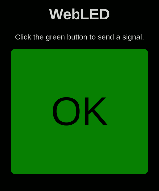

# WebLED

An IoT learning project to blink a LED using the ESP8266 chip. LED/pin status is controlled via a web page served by the device. The web page can be written as a regular html file.

Wifi and access point may be configured using configuration files.

The program was made to open (or close) a motorized garage door. There is a BC548 transistor with a 320 Ω resistor in the 3.3 V signal line to close the garage door opener circuit, which operates at voltages near 20 V. This keeps the current on the ESP8266 below 10 mA.
